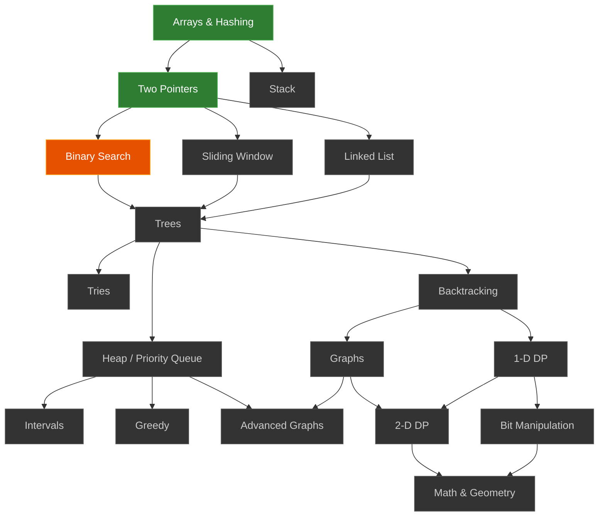

# 🧠 Blind 75 — Sai Srikar

**Grinding DSA from first principles · Python · Started June 2026**

[](https://leetcode.com/u/saisrikar07/)
[](#progress)
[](https://linkedin.com/in/sai-srikar-b-54b1b8359)

---

## What this is

Working through the [Blind 75](https://neetcode.io/practice), one topic at a time.
Solutions go in once they pass and I can explain the approach, not before.

> Currently: **Binary Search** · Next up: **Sliding Window**

---

## Roadmap



🟢 done · 🟠 in progress · ⬛ queued

---

## Progress

| Topic | Status | Problems |
|---|---|---|
| Arrays & Hashing | 🟢 Done | Contains Duplicate, Valid Anagram, Group Anagrams, Longest Consecutive Sequence, Product of Array Except Self, Encode and Decode Strings, Top K Frequent Elements, Valid Sudoku |
| Two Pointers | 🟢 Done | Valid Palindrome, Container With Most Water, 3Sum, Two Sum II |
| Binary Search | 🟡 In Progress | Find Minimum in Rotated Sorted Array |
| Sliding Window | 🔜 Up Next | — |
| Stack | ⬜ Queued | — |
| Linked List | ⬜ Queued | — |
| Trees | ⬜ Queued | — |
| Graphs | ⬜ Queued | — |
| Dynamic Programming | ⬜ Queued | — |

**13 / 75 solved** · Table updated as topics complete

---

## Repo structure

```
<topic>/
  <problem-slug>/
    submission-0.py    ← first working attempt
    submission-1.py    ← optimized (if revisited)
```

Multiple submissions on the same problem = I came back to improve
time/space complexity or try a cleaner approach. That's the point.

---

## How I approach each problem

1. **Think first** — spend up to 20 minutes on the problem before touching code; sketch the logic, write pseudocode
2. **Code it out** — translate the pseudocode into Python and debug independently
3. **Get unstuck smartly** — if still stuck, check the NeetCode solution or use AI for a nudge in the right direction, not the answer
4. **Verify the approach** — cross-check for a cleaner or more optimal solution once it passes
5. **Lock it in** — comment the *why* behind the approach, not just the *what*

The goal isn't to solve it fast. It's to never need to look up the same pattern twice.

---

## Background

2nd year B.Tech · AI & Data Science · Rajalakshmi Engineering College, Chennai
Long-term target: **AI/ML Security Engineering**

---

*Day 12. Long way to go. Doing it anyway.*
