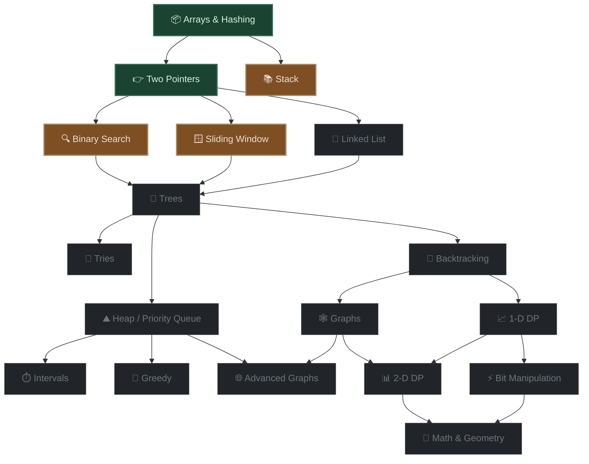

<div align="center">

# ⚡ Blind 75 & NeetCode Solutions

<p align="center">
  <b>Systematic Algorithmic Problem Solving from First Principles • Clean Python 3 • Continuous Iterative Optimization</b>
</p>

<!-- BADGES:START -->
[](https://leetcode.com/u/saisrikar07/) [-2563EB?style=for-the-badge&logo=target&logoColor=white)](#-live-metrics-dashboard) [](#-complete-solutions-directory) [](#-complete-solutions-directory) [](#-complete-solutions-directory) [](#-iterative-refinement-framework) [](https://python.org) [](https://github.com/Saisrikar20/neetcode-submissions/actions) [](https://linkedin.com/in/sai-srikar-b-54b1b8359) [](https://github.com/Saisrikar20/neetcode-submissions)
<!-- BADGES:END -->

<br/>

</div>

---

## 🧭 Executive Overview

This repository documents my deliberate practice journey through the **[Blind 75](https://neetcode.io/practice)** and **[NeetCode 150](https://neetcode.io/practice)** DSA curriculums. 

Every solution here adheres to a strict engineering standard:
- **No passive memorization:** Problems are solved from ground truth principles before inspecting reference material.
- **Iterative code evolution:** Multiple submissions per problem (`v0` $\rightarrow$ `v1` $\rightarrow$ `v2`) record the journey from an initial brute-force approach to time- and space-optimal implementations.
- **Automated CI/CD tracking:** A GitHub Actions workflow continuously audits the repository upon each push, dynamically recalculating problem counts, difficulty distributions, and iteration metrics.

---

## 📊 Live Metrics Dashboard

The metrics below are automatically synchronized with the codebase via GitHub Actions:

<!-- METRICS:START -->
| Metric | Count | Visual Distribution / Goal | Status |
|:---|:---:|:---|:---:|
| 🎯 **Blind 75 Benchmark** | **20 / 75** | `████░░░░░░░░░░░` **26.7%** | ⚡ **In Flight** |
| 🟢 **Easy Problems** | **6** | `████░░░░░░░░` **30.0%** of solved | 🟢 Stable |
| 🟡 **Medium Problems** | **13** | `████████░░░░` **65.0%** of solved | 🟡 Core Focus |
| 🔴 **Hard Problems** | **1** | `█░░░░░░░░░░░` **5.0%** of solved | 🔴 Frontier |
| 🔁 **Submissions Tracked** | **27** | Avg **1.4** iterations / problem | 🚀 Iterative |
<!-- METRICS:END -->

> 💡 *Note: The Blind 75 target represents the canonical 75 core patterns required to master technical problem solving.*

---

## 🗺️ Curriculum Progression Roadmap

The following dependency graph models the progression path across core algorithmic paradigms:


```mermaid
graph TD
    AH["📦 Arrays & Hashing"]:::done --> TP["👉 Two Pointers"]:::done
    AH --> ST["📚 Stack"]:::progress
    TP --> BS["🔍 Binary Search"]:::progress
    TP --> SW["🪟 Sliding Window"]:::progress
    TP --> LL["🔗 Linked List"]:::queued
    BS --> TR["🌳 Trees"]:::queued
    SW --> TR
    LL --> TR
    TR --> TRI["🌲 Tries"]:::queued
    TR --> HPQ["⛰️ Heap / Priority Queue"]:::queued
    TR --> BT["🔄 Backtracking"]:::queued
    HPQ --> INT["⏱️ Intervals"]:::queued
    HPQ --> GR["🎯 Greedy"]:::queued
    HPQ --> AG["🌐 Advanced Graphs"]:::queued
    BT --> GRA["🕸️ Graphs"]:::queued
    BT --> DP1["📈 1-D DP"]:::queued
    GRA --> AG
    GRA --> DP2["📊 2-D DP"]:::queued
    DP1 --> DP2
    DP1 --> BM["⚡ Bit Manipulation"]:::queued
    DP2 --> MG["📐 Math & Geometry"]:::queued
    BM --> MG

    classDef done fill:#1b4332,stroke:#2d6a4f,stroke-width:2px,color:#d8f3dc;
    classDef progress fill:#7f4f24,stroke:#a68a64,stroke-width:2px,color:#ede0d4;
    classDef queued fill:#212529,stroke:#343a40,stroke-width:1px,color:#6c757d;
```

<div align="center">
  <b>🟢 Completed Category &nbsp;•&nbsp; 🟡 In Active Flight &nbsp;•&nbsp; ⚪ Queued Paradigm</b>
</div>

---

## 📋 Comprehensive Topic Matrix

High-level progress across all 18 Data Structures & Algorithms domains:

<!-- TOPICS_TABLE:START -->
| # | Topic | Status | Solved / Target | Completion Bar | Key Patterns Explored |
|:---:|:---|:---:|:---:|:---|:---|
| 01 | **[Arrays & Hashing](#arrays--hashing)** | 🟡 In Progress | **8** / 9 | `███████░` 89% | Bucket Sort, Hash Map, Hash Set, Length Delimiter, Prefix & Suffix Products |
| 02 | **[Two Pointers](#two-pointers)** | 🟡 In Progress | **4** / 5 | `██████░░` 80% | Two Pointers |
| 03 | **[Sliding Window](#sliding-window)** | 🟡 In Progress | **4** / 6 | `█████░░░` 67% | Sliding Window |
| 04 | **[Stack](#stack)** | 🟡 In Progress | **1** / 7 | `█░░░░░░░` 14% | Stack |
| 05 | **[Binary Search](#binary-search)** | 🟡 In Progress | **2** / 7 | `██░░░░░░` 29% | Binary Search |
| 06 | **[Linked List](#linked-list)** | 🟡 In Progress | **1** / 6 | `█░░░░░░░` 17% | Two Pointers |
| 07 | **Trees** | ⚪ Queued | **0** / 14 | `░░░░░░░░` 0% | — |
| 08 | **Tries** | ⚪ Queued | **0** / 3 | `░░░░░░░░` 0% | — |
| 09 | **Heap / Priority Queue** | ⚪ Queued | **0** / 3 | `░░░░░░░░` 0% | — |
| 10 | **Backtracking** | ⚪ Queued | **0** / 2 | `░░░░░░░░` 0% | — |
| 11 | **Graphs** | ⚪ Queued | **0** / 6 | `░░░░░░░░` 0% | — |
| 12 | **Advanced Graphs** | ⚪ Queued | **0** / 1 | `░░░░░░░░` 0% | — |
| 13 | **1-D DP** | ⚪ Queued | **0** / 8 | `░░░░░░░░` 0% | — |
| 14 | **2-D DP** | ⚪ Queued | **0** / 2 | `░░░░░░░░` 0% | — |
| 15 | **Greedy** | ⚪ Queued | **0** / 3 | `░░░░░░░░` 0% | — |
| 16 | **Intervals** | ⚪ Queued | **0** / 6 | `░░░░░░░░` 0% | — |
| 17 | **Math & Geometry** | ⚪ Queued | **0** / 2 | `░░░░░░░░` 0% | — |
| 18 | **Bit Manipulation** | ⚪ Queued | **0** / 7 | `░░░░░░░░` 0% | — |
<!-- TOPICS_TABLE:END -->

---

## 📂 Complete Solutions Directory

Click any drawer below to inspect individual problems, direct links to code files, and chronological iteration histories. For a flat catalog table, refer to [**`SOLUTIONS.md`**](./SOLUTIONS.md).

<!-- SOLUTIONS_TABLE:START -->
> 💡 **Pro Tip:** Click any category drawer below to expand solutions and iterations. Multiple versions (`v0`, `v1`, `v2`) reflect progressive optimization from initial working brute-force to optimal time/space complexity.

<details open>
<summary><b id="arrays--hashing">📁 Arrays & Hashing (8/9 solved — 88%)</b> — <i>Click to expand/collapse</i></summary>

| # | Problem Title | LeetCode | Difficulty | Iterations | Latest Code | Algorithmic Pattern |
|:---:|:---|:---:|:---:|:---:|:---:|:---|
| 36 | **[Valid Sudoku](https://neetcode.io/problems/valid-sudoku)** | [#36 LC](https://leetcode.com/problems/valid-sudoku/) | 🟡 **Medium** | [v0](./Data%20Structures%20%26%20Algorithms/Arrays%20%26%20Hashing/valid-sudoku/submission-0.py) | [💻 **v0**](./Data%20Structures%20%26%20Algorithms/Arrays%20%26%20Hashing/valid-sudoku/submission-0.py) | `Hash Set, Grid Coordinate Hashing` |
| 49 | **[Group Anagrams](https://neetcode.io/problems/anagram-groups)** | [#49 LC](https://leetcode.com/problems/group-anagrams/) | 🟡 **Medium** | [v0](./Data%20Structures%20%26%20Algorithms/Arrays%20%26%20Hashing/anagram-groups/submission-0.py) | [💻 **v0**](./Data%20Structures%20%26%20Algorithms/Arrays%20%26%20Hashing/anagram-groups/submission-0.py) | `Hash Map, Frequency Tuple` |
| 128 | **[Longest Consecutive Sequence](https://neetcode.io/problems/longest-consecutive-sequence)** | [#128 LC](https://leetcode.com/problems/longest-consecutive-sequence/) | 🟡 **Medium** | [v0](./Data%20Structures%20%26%20Algorithms/Arrays%20%26%20Hashing/longest-consecutive-sequence/submission-0.py) | [💻 **v0**](./Data%20Structures%20%26%20Algorithms/Arrays%20%26%20Hashing/longest-consecutive-sequence/submission-0.py) | `Hash Set, Sequence Start` |
| 217 | **[Contains Duplicate](https://neetcode.io/problems/duplicate-integer)** | [#217 LC](https://leetcode.com/problems/contains-duplicate/) | 🟢 **Easy** | [v0](./Data%20Structures%20%26%20Algorithms/Arrays%20%26%20Hashing/duplicate-integer/submission-0.py) · [v1](./Data%20Structures%20%26%20Algorithms/Arrays%20%26%20Hashing/duplicate-integer/submission-1.py) · [v2](./Data%20Structures%20%26%20Algorithms/Arrays%20%26%20Hashing/duplicate-integer/submission-2.py) | [💻 **v2**](./Data%20Structures%20%26%20Algorithms/Arrays%20%26%20Hashing/duplicate-integer/submission-2.py) | `Hash Set, Lookup` |
| 238 | **[Product of Array Except Self](https://neetcode.io/problems/products-of-array-discluding-self)** | [#238 LC](https://leetcode.com/problems/product-of-array-except-self/) | 🟡 **Medium** | [v0](./Data%20Structures%20%26%20Algorithms/Arrays%20%26%20Hashing/products-of-array-discluding-self/submission-0.py) | [💻 **v0**](./Data%20Structures%20%26%20Algorithms/Arrays%20%26%20Hashing/products-of-array-discluding-self/submission-0.py) | `Prefix & Suffix Products` |
| 242 | **[Valid Anagram](https://neetcode.io/problems/is-anagram)** | [#242 LC](https://leetcode.com/problems/valid-anagram/) | 🟢 **Easy** | [v2](./Data%20Structures%20%26%20Algorithms/Arrays%20%26%20Hashing/is-anagram/submission-2.py) | [💻 **v2**](./Data%20Structures%20%26%20Algorithms/Arrays%20%26%20Hashing/is-anagram/submission-2.py) | `Hash Map, Frequency Count` |
| 271 | **[Encode and Decode Strings](https://neetcode.io/problems/string-encode-and-decode)** | [#271 LC](https://leetcode.com/problems/encode-and-decode-strings/) | 🟡 **Medium** | [v0](./Data%20Structures%20%26%20Algorithms/Arrays%20%26%20Hashing/string-encode-and-decode/submission-0.py) | [💻 **v0**](./Data%20Structures%20%26%20Algorithms/Arrays%20%26%20Hashing/string-encode-and-decode/submission-0.py) | `Length Delimiter, Parsing` |
| 347 | **[Top K Frequent Elements](https://neetcode.io/problems/top-k-elements-in-list)** | [#347 LC](https://leetcode.com/problems/top-k-frequent-elements/) | 🟡 **Medium** | [v0](./Data%20Structures%20%26%20Algorithms/Arrays%20%26%20Hashing/top-k-elements-in-list/submission-0.py) · [v1](./Data%20Structures%20%26%20Algorithms/Arrays%20%26%20Hashing/top-k-elements-in-list/submission-1.py) | [💻 **v1**](./Data%20Structures%20%26%20Algorithms/Arrays%20%26%20Hashing/top-k-elements-in-list/submission-1.py) | `Bucket Sort, Min-Heap` |

</details>

<details open>
<summary><b id="two-pointers">📁 Two Pointers (4/5 solved — 80%)</b> — <i>Click to expand/collapse</i></summary>

| # | Problem Title | LeetCode | Difficulty | Iterations | Latest Code | Algorithmic Pattern |
|:---:|:---|:---:|:---:|:---:|:---:|:---|
| 11 | **[Container With Most Water](https://neetcode.io/problems/max-water-container)** | [#11 LC](https://leetcode.com/problems/container-with-most-water/) | 🟡 **Medium** | [v0](./Data%20Structures%20%26%20Algorithms/Two%20Pointers/max-water-container/submission-0.py) | [💻 **v0**](./Data%20Structures%20%26%20Algorithms/Two%20Pointers/max-water-container/submission-0.py) | `Two Pointers, Greedy Height Boundary` |
| 15 | **[3Sum](https://neetcode.io/problems/three-integer-sum)** | [#15 LC](https://leetcode.com/problems/3sum/) | 🟡 **Medium** | [v1](./Data%20Structures%20%26%20Algorithms/Two%20Pointers/three-integer-sum/submission-1.py) · [v2](./Data%20Structures%20%26%20Algorithms/Two%20Pointers/three-integer-sum/submission-2.py) · [v3](./Data%20Structures%20%26%20Algorithms/Two%20Pointers/three-integer-sum/submission-3.py) | [💻 **v3**](./Data%20Structures%20%26%20Algorithms/Two%20Pointers/three-integer-sum/submission-3.py) | `Two Pointers, Sorting, Duplicate Elimination` |
| 125 | **[Valid Palindrome](https://neetcode.io/problems/is-palindrome)** | [#125 LC](https://leetcode.com/problems/valid-palindrome/) | 🟢 **Easy** | [v0](./Data%20Structures%20%26%20Algorithms/Two%20Pointers/is-palindrome/submission-0.py) · [v1](./Data%20Structures%20%26%20Algorithms/Two%20Pointers/is-palindrome/submission-1.py) | [💻 **v1**](./Data%20Structures%20%26%20Algorithms/Two%20Pointers/is-palindrome/submission-1.py) | `Two Pointers, String Cleansing` |
| 167 | **[Two Sum II - Input Array Is Sorted](https://neetcode.io/problems/two-integer-sum-ii)** | [#167 LC](https://leetcode.com/problems/two-sum-ii-input-array-is-sorted/) | 🟡 **Medium** | [v0](./Data%20Structures%20%26%20Algorithms/Two%20Pointers/two-integer-sum-ii/submission-0.py) | [💻 **v0**](./Data%20Structures%20%26%20Algorithms/Two%20Pointers/two-integer-sum-ii/submission-0.py) | `Two Pointers, Sorted Array Shrink` |

</details>

<details open>
<summary><b id="sliding-window">📁 Sliding Window (4/6 solved — 66%)</b> — <i>Click to expand/collapse</i></summary>

| # | Problem Title | LeetCode | Difficulty | Iterations | Latest Code | Algorithmic Pattern |
|:---:|:---|:---:|:---:|:---:|:---:|:---|
| 3 | **[Longest Substring Without Repeating Characters](https://neetcode.io/problems/longest-substring-without-duplicates)** | [#3 LC](https://leetcode.com/problems/longest-substring-without-repeating-characters/) | 🟡 **Medium** | [v0](./Data%20Structures%20%26%20Algorithms/Sliding%20Window/longest-substring-without-duplicates/submission-0.py) · [v1](./Data%20Structures%20%26%20Algorithms/Sliding%20Window/longest-substring-without-duplicates/submission-1.py) | [💻 **v1**](./Data%20Structures%20%26%20Algorithms/Sliding%20Window/longest-substring-without-duplicates/submission-1.py) | `Sliding Window, Set / Last Seen Map` |
| 76 | **[Minimum Window Substring](https://neetcode.io/problems/minimum-window-with-characters)** | [#76 LC](https://leetcode.com/problems/minimum-window-substring/) | 🔴 **Hard** | [v0](./Data%20Structures%20%26%20Algorithms/Sliding%20Window/minimum-window-with-characters/submission-0.py) | [💻 **v0**](./Data%20Structures%20%26%20Algorithms/Sliding%20Window/minimum-window-with-characters/submission-0.py) | `Sliding Window, Frequency Tracking` |
| 121 | **[Best Time to Buy and Sell Stock](https://neetcode.io/problems/buy-and-sell-crypto)** | [#121 LC](https://leetcode.com/problems/best-time-to-buy-and-sell-stock/) | 🟢 **Easy** | [v2](./Data%20Structures%20%26%20Algorithms/Sliding%20Window/buy-and-sell-crypto/submission-2.py) | [💻 **v2**](./Data%20Structures%20%26%20Algorithms/Sliding%20Window/buy-and-sell-crypto/submission-2.py) | `Sliding Window, Min Tracking` |
| 424 | **[Longest Repeating Character Replacement](https://neetcode.io/problems/longest-repeating-substring-with-replacement)** | [#424 LC](https://leetcode.com/problems/longest-repeating-character-replacement/) | 🟡 **Medium** | [v0](./Data%20Structures%20%26%20Algorithms/longest-repeating-substring-with-replacement/submission-0.py) | [💻 **v0**](./Data%20Structures%20%26%20Algorithms/longest-repeating-substring-with-replacement/submission-0.py) | `Sliding Window, Max Frequency` |

</details>

<details open>
<summary><b id="stack">📁 Stack (1/7 solved — 14%)</b> — <i>Click to expand/collapse</i></summary>

| # | Problem Title | LeetCode | Difficulty | Iterations | Latest Code | Algorithmic Pattern |
|:---:|:---|:---:|:---:|:---:|:---:|:---|
| 20 | **[Valid Parentheses](https://neetcode.io/problems/validate-parentheses)** | [#20 LC](https://leetcode.com/problems/valid-parentheses/) | 🟢 **Easy** | [v6](./Data%20Structures%20%26%20Algorithms/Stack/validate-parentheses/submission-6.py) | [💻 **v6**](./Data%20Structures%20%26%20Algorithms/Stack/validate-parentheses/submission-6.py) | `Stack, LIFO Matching` |

</details>

<details open>
<summary><b id="binary-search">📁 Binary Search (2/7 solved — 28%)</b> — <i>Click to expand/collapse</i></summary>

| # | Problem Title | LeetCode | Difficulty | Iterations | Latest Code | Algorithmic Pattern |
|:---:|:---|:---:|:---:|:---:|:---:|:---|
| 33 | **[Search in Rotated Sorted Array](https://neetcode.io/problems/find-target-in-rotated-sorted-array)** | [#33 LC](https://leetcode.com/problems/search-in-rotated-sorted-array/) | 🟡 **Medium** | [v1](./Data%20Structures%20%26%20Algorithms/Binary%20Search/find-target-in-rotated-sorted-array/submission-1.py) | [💻 **v1**](./Data%20Structures%20%26%20Algorithms/Binary%20Search/find-target-in-rotated-sorted-array/submission-1.py) | `Binary Search, Halves Discrimination` |
| 153 | **[Find Minimum in Rotated Sorted Array](https://neetcode.io/problems/find-minimum-in-rotated-sorted-array)** | [#153 LC](https://leetcode.com/problems/find-minimum-in-rotated-sorted-array/) | 🟡 **Medium** | [v8](./Data%20Structures%20%26%20Algorithms/Binary%20Search/find-minimum-in-rotated-sorted-array/submission-8.py) | [💻 **v8**](./Data%20Structures%20%26%20Algorithms/Binary%20Search/find-minimum-in-rotated-sorted-array/submission-8.py) | `Binary Search, Pivot Detection` |

</details>

<details open>
<summary><b id="linked-list">📁 Linked List (1/6 solved — 16%)</b> — <i>Click to expand/collapse</i></summary>

| # | Problem Title | LeetCode | Difficulty | Iterations | Latest Code | Algorithmic Pattern |
|:---:|:---|:---:|:---:|:---:|:---:|:---|
| 206 | **[Reverse Linked List](https://neetcode.io/problems/reverse-a-linked-list)** | [#206 LC](https://leetcode.com/problems/reverse-linked-list/) | 🟢 **Easy** | [v0](./Data%20Structures%20%26%20Algorithms/reverse-a-linked-list/submission-0.py) | [💻 **v0**](./Data%20Structures%20%26%20Algorithms/reverse-a-linked-list/submission-0.py) | `Two Pointers, Pointer Manipulation` |

</details>

<!-- SOLUTIONS_TABLE:END -->

---

## 🔁 Iterative Refinement Framework

The repository distinguishes itself by committing **every iteration** (`submission-0.py`, `submission-1.py`, `submission-2.py`...) rather than only the final optimal answer:

```
┌────────────────────────┐
│  submission-0.py       │ ──► Brute force approach ($O(N^2)$ or $O(N)$ auxiliary space)
└──────────┬─────────────┘
           │  Identify bottleneck (sorting, lookup overhead, redundant passes)
           ▼
┌────────────────────────┐
│  submission-1.py       │ ──► Intermediate optimization ($O(N \log N)$ or partial pruning)
└──────────┬─────────────┘
           │  Derive invariant (monotonicity, prefix sum, two-pointer bounds, hash state)
           ▼
┌────────────────────────┐
│  submission-2.py       │ ──► Optimal theoretical complexity ($O(N)$ time, $O(1)$ space)
└────────────────────────┘
```

### 🧠 Deliberate 5-Step Problem Protocol

1. **Think First (20-min lockout):** Diagram memory models and formulate invariants with pencil and pseudocode prior to coding.
2. **First Working Draft:** Implement the intuitive baseline (`submission-0.py`) to lock in correct boundary and edge-case behaviors.
3. **Directed Hinting:** If blocked, take directional nudges (pattern identification or NeetCode breakdown) without copying solutions.
4. **Complexity Optimization:** Refactor data structures (e.g. replacing nested lists with hash sets, or using two pointers to prune $O(N^2)$ combinations).
5. **Pattern Locking:** Document the core invariant in code comments to ensure the mental model is permanent.

---

## 🏗️ Repository Architecture

```text
neetcode-submissions/
├── .github/
│   └── workflows/
│       └── update_readme.yml          # CI/CD bot: triggers on solution pushes
├── scripts/
│   └── update_readme.py               # AST scanner, metrics calculator, and markdown builder
├── Data Structures & Algorithms/      # Category-partitioned solutions
│   ├── Arrays & Hashing/
│   │   ├── duplicate-integer/
│   │   │   ├── submission-0.py        # v0: Quadratic lookup attempt
│   │   │   ├── submission-1.py        # v1: Sorting approach
│   │   │   └── submission-2.py        # v2: Optimal O(N) hash set
│   │   └── ...
│   ├── Binary Search/
│   └── Two Pointers/
├── README.md                          # Live executive dashboard and topic index
└── SOLUTIONS.md                       # Comprehensive flat solution catalog
```

---

## 👨‍💻 About the Author

<table align="center">
  <tr>
    <td align="center">
      <b>Sai Srikar</b><br/>
      <sub>2nd Year B.Tech in Artificial Intelligence & Data Science</sub><br/>
      <sub>Rajalakshmi Engineering College, Chennai</sub><br/>
      <sub>Target Specialization: <b>AI / ML Security Engineering</b></sub>
      <br/><br/>
      <a href="https://github.com/Saisrikar20"></a>
      <a href="https://leetcode.com/u/saisrikar07/"></a>
      <a href="https://linkedin.com/in/sai-srikar-b-54b1b8359"></a>
    </td>
  </tr>
</table>

---

<div align="center">
  <sub>Maintained with ❤️ • Auto-indexed by GitHub Actions • Continuously evolving</sub>
</div>
